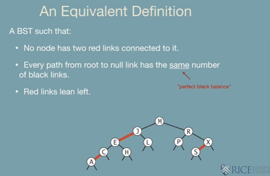

# Module 7: Looking Stuff Up

## L1 Searching Operations

### Generalizaed Searching

### The Search Interface

* Insert&#x20;
* delete
* search

### Binary Search Trees

Unsuccessful Binary Search Tree

### Tree Shape

* Many BSTs corresp

## Hibbard Deletion

## L2 Balanced Binary Trees

### Symbol Table Review

.png>)

.png>)

.png>)

### 2-3 Tree Search Demo

#### Insert Case 1

#### Insert Case 2

### 2-3 Tree: Implementation

## L3.1  Left-Leaning Red/Black Trees Part 1 (9:36)

.png>)

.png>)

## Lecture 3.2 | Left-Leaning Red/Black Trees Part 2 (12:17)
